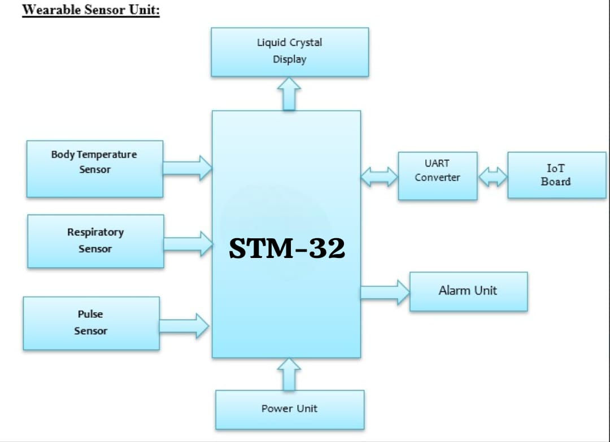

# Biomedical Monitoring System (Digital Twin using STM32)

A **real-time biomedical monitoring system** integrating **Digital Twin (DT)** and **IoT** technologies to improve **emergency response** in hospitals.  
Built using **STM32 microcontroller**, **biomedical sensors**, and **NodeMCU IoT module** for cloud data visualization.

---

##  Overview
Each patient is assigned a **Digital Twin–based Augmented Vision (AV) code**, allowing doctors to view their real-time physiological state.  
The system enables **faster diagnosis**, **priority-based emergency care**, and **remote patient tracking**.

---

##  Key Components
- **Sensors:** Body Temperature, Respiratory, Pulse  
- **Microcontroller:** STM32 (Embedded C)  
- **IoT:** NodeMCU for cloud connectivity  
- **Display:** LCD & Alarm Unit for alerts  

---

##  Features
- Real-time data monitoring and transmission  
- Cloud-based Digital Twin visualization  
- Priority detection (Red/Orange/Green severity levels)  
- Augmented Vision (AV) code for patient identification  

---
##  Block Diagram

### Wearable Sensor Unit
  
*(Example diagram showing STM32, sensors, and IoT interface)*

---

##  Hardware Requirements
1. **STM32 Microcontroller**  
2. **Body Temperature Sensor**  
3. **Respiratory Sensor**  
4. **Pulse Sensor**  
5. **NodeMCU IoT Module**  
6. **Liquid Crystal Display (LCD)**  
7. **Alarm/Buzzer Unit**  
8. **Power Supply Unit**

---

##  Software & Tools
- **STM32CubeIDE** – Development and debugging  
- **Embedded C Language** – Firmware programming  
- **Hi-Tech Compiler** – Code compilation  
- **MATLAB / Simulink (optional)** – Data visualization and simulation  

##  Future Enhancements
- CNN-based predictive analysis  
- Integration of ECG & SpO₂ sensors  
- BLE-based wireless communication  

---

##  Developing in progress By
**Sakthivel Balakumar**  
Embedded Systems Enthusiast 

---
##  License
Independent project for learning and research in embedded systems.  
Reuse allowed with credit. Commercial use prohibited.
